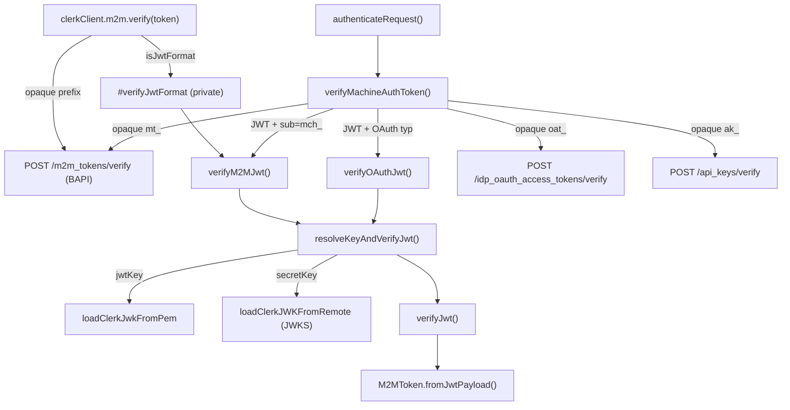

# m2m-jwt-verify

## Summary

Implemented JWT format support for M2M tokens in the Clerk JavaScript backend SDK. The work involved cleaning up comments, fixing an ESLint unbound-method issue, refactoring the JWT machine token verification to eliminate a generic callback pattern, and making `clerkClient.m2m.verify()` handle both opaque and JWT-format M2M tokens transparently. All 1008 backend tests pass.

## Key Decisions

- **Extracted `verifyDecodedJwtMachineToken` to `jwt/verifyMachineJwt.ts`** to break a circular dependency (`M2MTokenApi → verify.ts → factory.ts → M2MTokenApi`) — avoids both duplication and cycles.
- **Replaced generic callback pattern** (`fromPayload` callback) with two typed functions `verifyM2MJwt` / `verifyOAuthJwt` sharing a private `resolveKeyAndVerifyJwt` helper — cleaner return types, no generics.
- **`M2MTokenApi` constructor extended** with `JwtMachineVerifyOptions` (secretKey, apiUrl) threaded from `factory.ts` — API layer can now do local JWT verification without touching `authenticateRequest`.
- **No changes to `authenticateRequest`** — JWT M2M tokens already bypass `m2m.verify()` in that path (routed to `verifyDecodedJwtMachineToken` directly), so no double verification risk.
- **Removed 4 unused internal exports** (`isMachineTokenType`, `getMachineTokenType`, `isM2MJwt`, `isMachineJwt`) from `internal.ts` — only keeping what other packages actually use.
- **Integration test reverts middleware route** — no longer needs `clerkMiddleware` for JWT format since `m2m.verify()` handles both formats directly.

## What Was Done

### Comment cleanup

- Removed redundant JSDoc/inline comments from `verify.ts`, `M2MToken.ts`
- Kept routing comments (`// M2M JWT: sub starts with mch_`, `// OAuth JWT: typ is at+jwt`, `// Opaque token routing by prefix`)

### ESLint fix

- `M2MToken.fromJwtPayload` and `IdPOAuthAccessToken.fromJwtPayload` wrapped in arrow functions `(payload, skew) => X.fromJwtPayload(payload, skew)` to fix `@typescript-eslint/unbound-method`
- Consolidated duplicate try/catch in `verifyMachineAuthToken` decode error path using `if (decodeErrors) throw decodeErrors[0]`

### `internal.ts` trim

- Removed exports not consumed by any other package: `isMachineTokenType`, `getMachineTokenType`, `isM2MJwt`, `isMachineJwt`
- Kept: `isMachineTokenByPrefix`, `isTokenTypeAccepted`, `isMachineToken`, `verifyMachineAuthToken`

### New file: `packages/backend/src/jwt/verifyMachineJwt.ts`

- `resolveKeyAndVerifyJwt(token, kid, options, headerType?)` — private, returns `{ payload } | { error }`
- `verifyM2MJwt(token, decoded, options)` — exported, returns `MachineTokenReturnType<M2MToken, ...>`
- `verifyOAuthJwt(token, decoded, options)` — exported, returns `MachineTokenReturnType<IdPOAuthAccessToken, ...>`
- Imports M2MToken/IdPOAuthAccessToken from `api/resources/` (no circular dep since resources don't import factory)

### `packages/backend/src/tokens/verify.ts`

- Removed `verifyDecodedJwtMachineToken` function body (moved to `verifyMachineJwt.ts`)
- Swapped import: `verifyDecodedJwtMachineToken` → `{ verifyM2MJwt, verifyOAuthJwt }`
- Two call sites now: `verifyM2MJwt(token, decodedResult, options)` and `verifyOAuthJwt(token, decodedResult, options)`

### `packages/backend/src/api/endpoints/M2MTokenApi.ts`

- Constructor extended: `constructor(request, verifyOptions: JwtMachineVerifyOptions = {})`
- New `#verifyJwtFormat(token)` private method (JS `#` syntax — truly private, not just TS `private`)
  - Decodes JWT, throws `MachineTokenVerificationError` on failure
  - Calls `verifyM2MJwt`, throws on errors, returns `M2MToken`
- `verify()` now: JWT → `#verifyJwtFormat(token)`, opaque → BAPI
- Removed `TokenType` import (no longer needed), kept `MachineTokenVerificationError`, `decodeJwt`, `isJwtFormat`

### `packages/backend/src/api/factory.ts`

- `M2MTokenApi` now gets second arg: `{ secretKey: options.secretKey, apiUrl: options.apiUrl }`

### `integration/tests/machine-auth/m2m.test.ts`

- Server template uses `clerkClient.m2m.verify({ token })` (was `verifyToken` — deprecated) on single `/api/protected` route
- Removed `/api/jwt-protected` middleware route (no longer needed)
- Response uses `m2mToken.subject` instead of `m2mToken.id` (consistent for both formats)
- Added test: `'verifies JWT format M2M token via local verification'` — creates `tokenFormat: 'jwt'` token, calls single route, asserts 200 + correct subject

### Test verification

- `packages/backend`: 56 test files, 1008 tests, 0 type errors ✓

## Open Questions / Follow-ups

- [ ] Integration test assertions use `emailServer.id` as the expected subject — need to confirm the machine's `id` field matches the JWT `sub` claim when running against real API
- [ ] `jwtKey` (PEM public key) is not threaded through `factory.ts` to `M2MTokenApi` — only `secretKey` + `apiUrl`. Add `jwtKey` support if networkless M2M JWT verification is needed
- [ ] `verifyToken` deprecation in `M2MTokenApi` — confirm timeline for removal
- [ ] Consider whether `verifyMachineAuthToken` should also be removed from `internal.ts` exports since it's not consumed externally yet (currently kept as it's the core machine auth function)

## Context for Next Session

**Key files:**

- `packages/backend/src/jwt/verifyMachineJwt.ts` — new shared module, source of truth for JWT machine token verification
- `packages/backend/src/api/endpoints/M2MTokenApi.ts` — `verify()` now handles both opaque + JWT; `#verifyJwtFormat` is the private JWT path
- `packages/backend/src/tokens/verify.ts` — `verifyMachineAuthToken` routes JWT M2M/OAuth to the new typed helpers
- `packages/backend/src/api/factory.ts` — threads `secretKey` + `apiUrl` into `M2MTokenApi`
- `integration/tests/machine-auth/m2m.test.ts` — single route integration test covering opaque + JWT format
- `docs/plans/2026-02-23-m2m-jwt-verify-in-api-client.md` — the implementation plan (now fully executed)

**Run tests:**

```bash
cd packages/backend && pnpm run test:node
```

Note: if vitest fails with `Cannot find module`, delete `packages/backend/node_modules` and run `pnpm install` from root.

**Branch:** `rob/USER-4704-m2m-jwts` — merges from `release/core-2`

## Diagram


