# `packages/ui` — Comprehensive Interaction Map

> A single, authoritative catalog of **every user-facing interaction** the Clerk internal UI library exposes, plus the edge cases each one handles.
>
> **Why this exists:** interaction behavior in this package is implemented implicitly across ~80 `elements/`, ~38 `primitives/`, and 28 component flows under `src/components/`. When you change an interaction, it's easy to regress a subtle behavior — double-submit guards, reverification cancel, reduced-motion, focus/scroll management. This map documents the shared machinery once, then references it from each flow, and ends with a flat edge-case checklist.
>
> **Note on the email form:** this map documents the **established card-based** add-email pattern. An experimental `inline` variant is being prototyped on the working tree but is intentionally **not** documented here.
>
> **Scope:** user-facing interactions only (gestures, state transitions, feedback). It does **not** document styling, theming, or the appearance API (see `references/theming-architecture.md` for those).
>
> **Reading order:** Part 0 (legend) → Part 1 (the machinery, where most behavior lives) → Part 2 (cross-cutting concerns) → Part 3 (per-flow inventory) → Part 4 (edge-case checklist).

---

## Part 0 — How to read this map

### Taxonomy

Every interaction is described along five axes:

| Axis                  | Meaning                                                                                                              |
| --------------------- | -------------------------------------------------------------------------------------------------------------------- | --------------- |
| **Surface / gesture** | What the user touches and how (click, type, Enter, Escape, arrow keys, hover, focus, drag, paste).                   |
| **Trigger**           | The handler or mechanism that fires (`onSubmit`, `onClick`, `onKeyDown`, `onChange`, MutationObserver, media query). |
| **States**            | The states the interaction moves through (`idle → loading → success                                                  | error → idle`). |
| **Edge cases**        | The non-happy-path behavior that is easy to regress.                                                                 |
| **File**              | Where it lives, as `src/...:line`.                                                                                   |

### The universal interaction lifecycle

Almost every async interaction in the package follows one shape. It's worth internalizing once because Parts 1–3 reference it constantly:

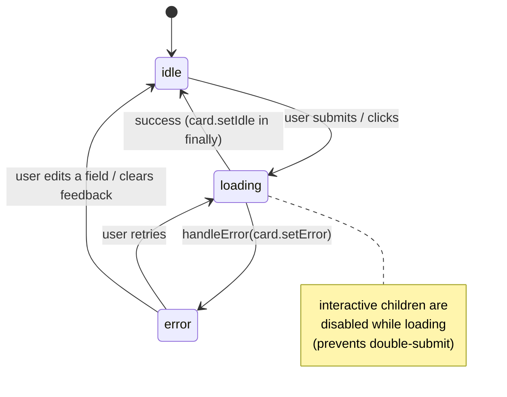

This is enforced structurally: see `Form.tsx` (Part 1.1) and the card/status state machine (Part 1.3).

### User-action notation

Each interaction below has a **User actions** block listing the _literal_ steps a person performs, separated from what the system does in response:

- **▸** = a step the user **must** take.
- **○** = an **optional** step the user may take.
- **↳ system:** = the automatic response (not a user action) — shown only where it clarifies what to do next.

So a line reads like: `▸ Press Enter in any field. ↳ system: buttons disable and a spinner shows.` In the table-style sections (1.10, 1.11), the **Gesture** column _is_ the literal user action.

### Diagram conventions

- `stateDiagram-v2` blocks = interaction state machines.
- `flowchart` blocks = decision/routing logic.
- Solid arrows = automatic transitions; labels = the gesture or condition that causes them.

---

## Part 1 — Shared interaction primitives (the machinery)

This is where the majority of interaction behavior lives. Each flow in Part 3 is assembled almost entirely from these.

### 1.1 Form submission — `src/elements/Form.tsx`

The single most important interaction primitive. `Form.Root` wraps every form in the package and owns the submit lifecycle.

| Axis              | Detail                                                                                                                               |
| ----------------- | ------------------------------------------------------------------------------------------------------------------------------------ |
| Surface / gesture | Click the submit button, **or** press **Enter** in any field.                                                                        |
| Trigger           | `onSubmit` on the native `<form>` (`Form.tsx:29`).                                                                                   |
| States            | On submit: `card.setLoading()` + `status.setLoading()` → `await props.onSubmit(e)` → `finally { card.setIdle(); status.setIdle() }`. |
| Edge cases        | Listed below.                                                                                                                        |

**User actions:**

- **▸** Fill in the field(s).
- **▸** Submit — _either_ click the primary button _or_ press **Enter** while focused in any field. ↳ system: all buttons disable and a spinner shows for the duration.
- **↳ system:** on success the flow advances (next step / success page); on failure a field or global error appears and the buttons re-enable.
- **○** Click the reset/cancel button to abandon (disabled while submitting).

**Edge cases:**

1. **Enter-to-submit without `type=submit` on visible buttons.** A `visibility:hidden`, `position:absolute`, `aria-hidden` `<button type='submit'>` is injected as the **first** child of every form (`Form.tsx:66-71`). This lets Enter submit the form without adding `type=submit` to action buttons (which would conflict with CSS resets like Tailwind's). `display:none` is deliberately avoided — **Safari ignores a `display:none` submit button**.
2. **Double-submit prevention.** `isDisabled = card.isLoading || status.isLoading` (`Form.tsx:48`) is fed to `Form.SubmitButton`/`Form.ResetButton`, so both are disabled the instant submission starts and re-enabled only in the `finally` block — even if the promise rejects.
3. **`submittedWithEnter` flag** is exposed via `FormState` context for components that need to know the form was keyboard-submitted (`Form.tsx:27,38,48`).
4. **`preventDefault` + `stopPropagation`** are always called, and submission is a no-op if no `onSubmit` prop is provided (`Form.tsx:30-34`).

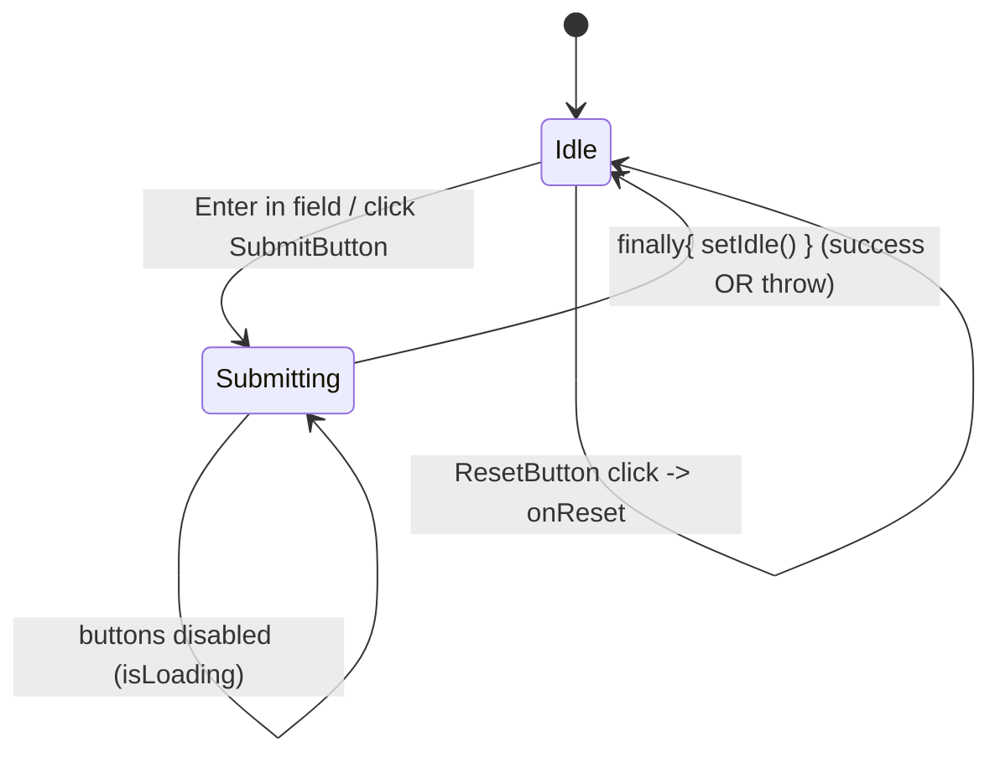

`Form` also exposes the input building blocks every form uses: `Form.PlainInput`, `Form.PasswordInput`, `Form.PhoneInput`, `Form.OTPInput`, `Form.InputGroup`, `Form.RadioGroup`, `Form.Checkbox`, `Form.ControlRow` (`Form.tsx:311-324`). All wrap `Field.*` (Part 1.2).

### 1.2 Fields & validation — `src/elements/FieldControl.tsx`, `src/utils/useFormControl.ts`

Field-level interaction: typing, focus/blur, per-field feedback.

| Axis              | Detail                                                                             |
| ----------------- | ---------------------------------------------------------------------------------- | ------- | ------- | ---- | -------------------------------------------------------------------------- |
| Surface / gesture | Type, focus, blur, click a field action link (e.g. "Forgot password?").            |
| Trigger           | `onChange` / `onFocus` / `onBlur` from `useFormControl`; `Field.Action` `onClick`. |
| States            | Per-field feedback: `error                                                         | warning | success | info | none`, via `setError`/`setWarning`/`setSuccess`/`setInfo`/`clearFeedback`. |
| Edge cases        | Listed below.                                                                      |

**User actions:**

- **▸** Click or Tab into the field to focus it.
- **▸** Type your value. ↳ system: input transformers run (e.g. email is trimmed) and any prior error/warning feedback clears as you edit.
- **○** Tab or click away to blur. ↳ system: blur-time validation may run and show feedback.
- **○** Click an inline field-action link if present (e.g. "Forgot password?").

**Edge cases:**

1. **Transformers run on input** before state updates (e.g. email auto-trim), in `useFormControl`.
2. **Disabled cascades from loading:** a field's effective disabled state is `isDisabledProp || card.isLoading` — fields lock automatically while the form submits.
3. **Two composition styles coexist:**
   - **Wrapped** — `Form.PlainInput` renders label-row + input + feedback in one go (the default; this is what the add-email form uses).
   - **Composable** — `Field.Root` / `Field.Input` / `Field.Feedback` assembled by hand. This is the lower-level API the wrapped `Form.*` inputs are built from (`CommonInputWrapper`, `Form.tsx:131-168`); reach for it directly only when you need custom layout around the input.
4. **`buildErrorMessage`** lets a field customize how an array of API errors becomes one message (e.g. password complexity; see Part 2.2).

### 1.3 Card / status state machine — `src/elements/contexts/index.tsx`

The shared async-state container behind the universal lifecycle.

| Axis       | Detail                                                                                                                                                                                       |
| ---------- | -------------------------------------------------------------------------------------------------------------------------------------------------------------------------------------------- | --------- | ----------------------------------- |
| States     | `'idle'                                                                                                                                                                                      | 'loading' | 'error'` (`contexts/index.tsx:10`). |
| API        | `setIdle(metadata?)`, `setLoading(metadata?)`, `setError(metadata)`, `runAsync(cb, metadata?)`, plus derived `isLoading`, `isIdle`, `loadingMetadata`, `error` (`contexts/index.tsx:42-70`). |
| Edge cases | Listed below.                                                                                                                                                                                |

**User actions:** none directly — this is the internal state container the other interactions drive. **What the user _sees_:** a spinner while `loading`, a re-enabled idle UI on success, and a translated error banner/field message on `error`.

**Edge cases:**

1. **`loadingMetadata`** carries an arbitrary tag during loading (`state.status === 'loading' ? state.metadata : undefined`). Used to spin **only the clicked button** among several (OAuth — Part 1.7).
2. **Errors survive navigation hydration:** on mount and on `router.currentPath` change, the provider reads `window.Clerk.__internal_last_error`, translates it, and seeds `state.error` (`contexts/index.tsx:24-36`). A redirect-based flow (OAuth callback) can therefore surface an error that originated before the redirect.
3. **`setError` translates** runtime/API errors through `translateError` for localization (`contexts/index.tsx:47-48`).
4. **`runAsync`** wraps a promise with `setLoading`→`finally setIdle`, mirroring the Form lifecycle for non-form async actions.

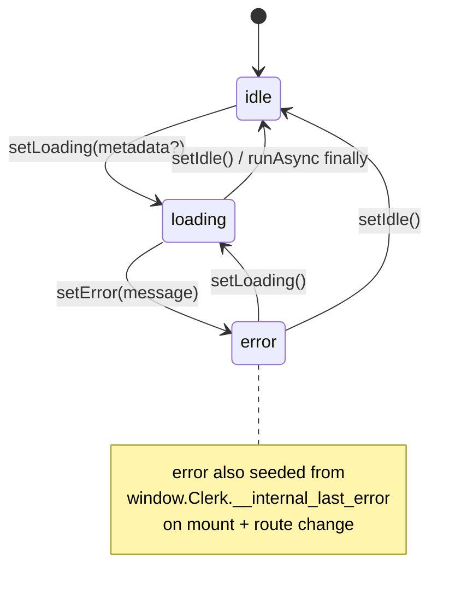

### 1.4 Action — inline expand/collapse — `src/elements/Action/*`

The state machine behind "click a row to reveal an inline form" (add email, remove email, verify, etc.).

| Axis              | Detail                                                                    |
| ----------------- | ------------------------------------------------------------------------- | --------------------------------------------------------------------------------------------------------- |
| Surface / gesture | Click a trigger to open; click cancel/save or call `close()` to collapse. |
| Trigger           | `ActionRoot` holds `active: string                                        | null`; `ActionTrigger`opens,`ActionOpen`renders when`active === value`, `ActionClosed` renders otherwise. |
| States            | `active = null` (collapsed) ↔ `active = '<value>'` (one section open).    |
| Edge cases        | Listed below.                                                             |

**User actions:**

- **▸** Click the row's trigger — the arrow/add button, or a ⋯-menu item like "Remove" / "Verify". ↳ system: that section expands inline and smoothly scrolls into view; any other open section collapses.
- **▸** Interact with the revealed form (fill + submit, or confirm a destructive action) **or** click cancel.
- **↳ system:** on save-success or cancel the section collapses back to the row.

**Edge cases:**

1. **Controlled or uncontrolled.** If a `value`/`onChange` pair is passed, `ActionRoot` is controlled; otherwise it keeps internal state (`ActionRoot.tsx:25-44`).
2. **Single-open invariant.** `active` is a single string, so opening one section implicitly closes any other — there's no multi-open mode.
3. **Trigger chains the child's own `onClick`.** `ActionTrigger` clones its child and `await`s the child's existing `onClick` **before** calling `open(value)`, so a row's own click logic runs first.
4. **Auto-scroll into view on open.** `ActionOpen` uses a MutationObserver to `scrollIntoView({ behavior: 'smooth', block: 'center' })` (with a short delay) when its content appears, so a newly revealed form isn't off-screen. Honors reduced motion via the smooth-scroll guard.
5. **Animated by default.** `ActionRoot` wraps its body in `<Animated>` unless `animate={false}` (`ActionRoot.tsx:48-52`).

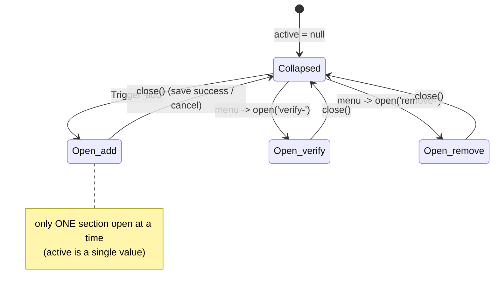

### 1.5 Wizard — multi-step flows — `src/common/Wizard.tsx`

Linear step navigation inside a single mounted component (email add → verify, phone add → verify, password, etc.).

| Axis              | Detail                                                                                                                              |
| ----------------- | ----------------------------------------------------------------------------------------------------------------------------------- |
| Surface / gesture | Indirect — steps advance as a result of a successful submit, not a direct user gesture.                                             |
| Trigger           | `useWizard()` → `nextStep()` / `prevStep()` / `goToStep(i)`; renders `React.Children.toArray(children)[step]` (`Wizard.tsx:15-37`). |
| States            | `step: number`, starting at `defaultStep`.                                                                                          |
| Edge cases        | Listed below.                                                                                                                       |

**User actions:** none directly — there are no "next/back" controls the user clicks. The user simply completes the current step's form; a **successful submit advances to the next step automatically** (e.g. enter email → land on the verify step). Going back happens only if a flow wires `prevStep()` to its own control.

**Edge cases:**

1. **Start mid-flow.** `defaultStep` lets a flow open directly on a later step — e.g. EmailForm opens on the **verify** step (step 1) when editing an existing unverified address, and on **entry** (step 0) when adding a new one (`EmailForm.tsx:70-73`).
2. **`onNextStep` side effect.** Fires before the step increments — EmailForm uses it to clear any card error when advancing (`EmailForm.tsx:72`).
3. **Animated by default.** Steps crossfade through `<Animated>` unless `animate={false}` (`Wizard.tsx:32-36`).

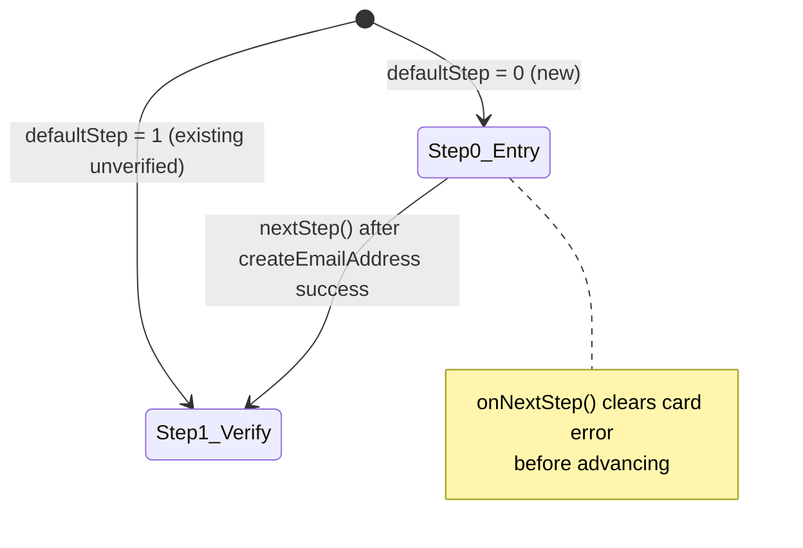

### 1.6 OTP / code entry — `src/elements/CodeControl.tsx`, `useFieldOTP`

Verification-code entry (email code, phone code, 2FA, backup code). High-density interaction logic.

| Axis              | Detail                                                                             |
| ----------------- | ---------------------------------------------------------------------------------- | ----------------------- |
| Surface / gesture | Type digits, paste a code, click "Resend".                                         |
| Trigger           | `input-otp` `OTPInput` with `pattern={REGEXP_ONLY_DIGITS}`, `inputMode='numeric'`. |
| States            | Per-segment fill → auto-submit on full length; feedback `error                     | success`; resend timer. |
| Edge cases        | Listed below.                                                                      |

**User actions:**

- **▸** Type the digits, or paste the whole code into the first slot. ↳ system: paste auto-distributes across slots.
- **↳ system:** the **last digit triggers verification automatically** — there is no submit button to click.
- **○** On failure, wait ~0.75s for the inputs to auto-clear, then re-enter. ↳ system: inputs reset for the retry.
- **○** If the code never arrived, click **Resend** once its countdown finishes.

**Edge cases:**

1. **Auto-submit on completion.** When `values.filter(c => c).length === length` (default 6), `onCodeEntryFinished(code)` fires automatically — no submit button (`CodeControl.tsx:114-124`). Partial codes just sync back to form state.
2. **750 ms settle on both outcomes.** `resolve` sets success feedback, `sleep(750)`, then calls `onResolve` — the user sees the success state before the screen moves. `reject` routes the error, `status.setIdle()`, `sleep(750)`, then `codeControl.reset()` to clear the inputs for a retry (`CodeControl.tsx:56-68`).
3. **Input lockout while resolving/feedback present.** Once any feedback exists, segments go disabled (`OTPCodeControl` sets `disabled` on `feedback`, and segments are disabled when `isLoading || disabled || feedbackType==='success'`) — prevents edits mid-verification (`CodeControl.tsx:166-216`).
4. **Resend is rate-limited by a timer.** `OTPResendButton` uses `TimerButton` with `startDisabled`, hides the counter on success, and disables on `isLoading` or success (`CodeControl.tsx:147-164`).
5. **`onFakeContinue`** lets a flow trigger the finished-callback with an empty code (used when verification completes out-of-band, e.g. via an email link in another tab).
6. **Caret + paste UX.** A blinking fake caret marks the active slot; paste is handled natively by `input-otp` splitting across slots (`CodeControl.tsx:192-292`).

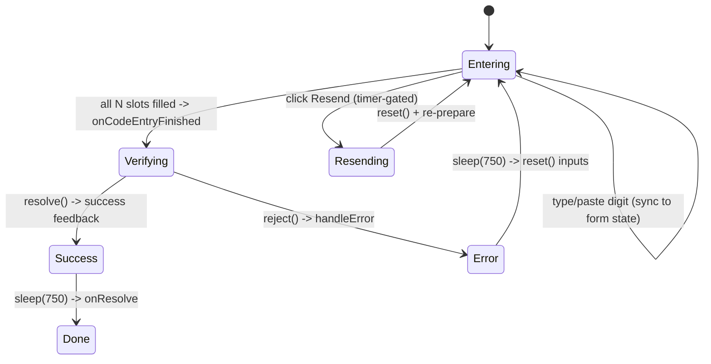

### 1.7 OAuth / social & Web3 buttons — `src/elements/SocialButtons.tsx`

| Axis              | Detail                                                                                                  |
| ----------------- | ------------------------------------------------------------------------------------------------------- |
| Surface / gesture | Click a provider button.                                                                                |
| Trigger           | `startOauth(strategy)` → `card.setLoading(strategy)` → provider callback (`SocialButtons.tsx:115-120`). |
| States            | Per-strategy loading via `loadingMetadata`.                                                             |
| Edge cases        | Listed below.                                                                                           |

**User actions:**

- **▸** Click one provider button (Google, GitHub, a wallet, …). ↳ system: only that button shows a spinner; the rest disable, then the browser redirects to the provider.
- **▸** Complete authentication on the provider's own site (external). ↳ system: redirects back; any failure surfaces as a card error on return.

**Edge cases:**

1. **Spin only the clicked button.** `setLoading(strategy)` stamps the strategy as `loadingMetadata`; each button compares its own strategy to decide whether to show a spinner. The others stay idle but disabled.
2. **`idleAfterDelay`.** Because OAuth typically redirects away, on error the card is reset after a `sleep(...)` rather than immediately, avoiding a flash of idle before navigation.
3. **Layout adapts to count.** `preferBlockButtons` flips between block and icon-only layouts based on `socialButtonsVariant` and the number of strategies; single-column-on-mobile when exactly two (`SocialButtons.tsx:106-113`).
4. **"Last used" badge.** When enabled, the previously used strategy is surfaced (SAML strategies normalized to OAuth for matching) (`SocialButtons.tsx:91-104`).

### 1.8 Menus — `src/elements/Menu.tsx`, `src/elements/ThreeDotsMenu.tsx`

The "⋯" overflow menu (per-email actions, member actions, session actions, etc.).

| Axis              | Detail                                                                                           |
| ----------------- | ------------------------------------------------------------------------------------------------ |
| Surface / gesture | Click trigger to toggle; **ArrowDown/ArrowUp** to move focus between items; click/Enter an item. |
| Trigger           | `usePopover`-backed open state; `onKeyDown` arrow handling.                                      |
| States            | open / closed; roving focus across `BUTTON` children.                                            |
| Edge cases        | Listed below.                                                                                    |

**User actions:**

- **▸** Click the **⋯** trigger to open the menu. ↳ system: the popover opens with `aria-expanded=true`.
- **▸** Pick an item — click it, **or** press **ArrowDown/ArrowUp** to move focus then **Enter**. ↳ system: the action runs and (by default) the menu closes.
- **○** Press **Escape** or click outside to dismiss without choosing.

**Edge cases:**

1. **ARIA wiring.** Trigger gets `aria-expanded`, `aria-haspopup='menu'`, optional `aria-label` (can be a function of open state); list is `role='menu'`, items `role='menuitem'` (`Menu.tsx:62-75,114-208`).
2. **Container-level ArrowDown only when the list itself is focused.** `MenuList.onKeyDown` early-returns unless `containerRef.current === document.activeElement`, then focuses the first item (`Menu.tsx:98-112`).
3. **Item-level arrow traversal skips non-buttons.** `findMenuItem` walks `previous/nextElementSibling` until it hits a `BUTTON`, so dividers/labels are stepped over (`Menu.tsx:77-85,163-177`).
4. **`closeAfterClick` (default true).** Items toggle the menu closed after their `onClick`; pass `false` to keep it open (`Menu.tsx:157-195`).
5. **Trigger chains the child's own `onClick`** before toggling (`Menu.tsx:70-74`).
6. **Destructive styling.** `destructive` items render in the danger color scheme.

### 1.9 Overlays — Modal, Drawer, Popover, PopoverCard — `src/elements/{Modal,Drawer,Popover,PopoverCard}.tsx`

| Axis              | Detail                                                                              |
| ----------------- | ----------------------------------------------------------------------------------- |
| Surface / gesture | Open programmatically; dismiss via **Escape**, outside press, or close button.      |
| Trigger           | `@floating-ui/react` (`usePopover`) for focus management, dismiss, and positioning. |
| States            | open / closed; focus trapped while open; body scroll locked.                        |
| Edge cases        | Listed below.                                                                       |

**User actions:** the overlay opens for the user (programmatically) — they don't open it. To **dismiss**, the user can:

- **○** Click the **✕ / close** button.
- **○** Press **Escape**.
- **○** Click the **backdrop** (outside the content box — clicking _inside_ the content does nothing).
- **▸** When `canCloseModal === false` (e.g. mid-payment), _none_ of the above work — the user **must complete the flow** to proceed.

**Edge cases (Modal — `Modal.tsx`):**

1. **Outside-press dismiss is backdrop-only.** `outsidePress: e => e.target === overlayRef.current` (`Modal.tsx:36`) — clicking the backdrop closes; clicking inside the content does **not**.
2. **`canCloseModal === false` disables dismissal entirely** — the context exposes no `toggle`, so Escape/outside-press/close are inert (`Modal.tsx:46`).
3. **Scroll lock on mount.** `useScrollLock().enableScrollLock()` in a layout effect, released on unmount (`Modal.tsx:27,48-54`).
4. **Outside elements inert + focus trapped.** `outsideElementsInert` plus an optional `initialFocusRef` for where focus lands (`Modal.tsx:63-65`).
5. **Dialog semantics.** `role='dialog'`, `aria-modal='true'` on the content (`Modal.tsx:93-94`).
6. **`handleOpen`/`handleClose` fire on the `isOpen` transition** (`Modal.tsx:39-45`).

**Drawer** (`Drawer.tsx`) adds the same dismiss/focus model with a slide animation and the same Escape/outside-press behavior; both honor reduced motion (Part 2.6).

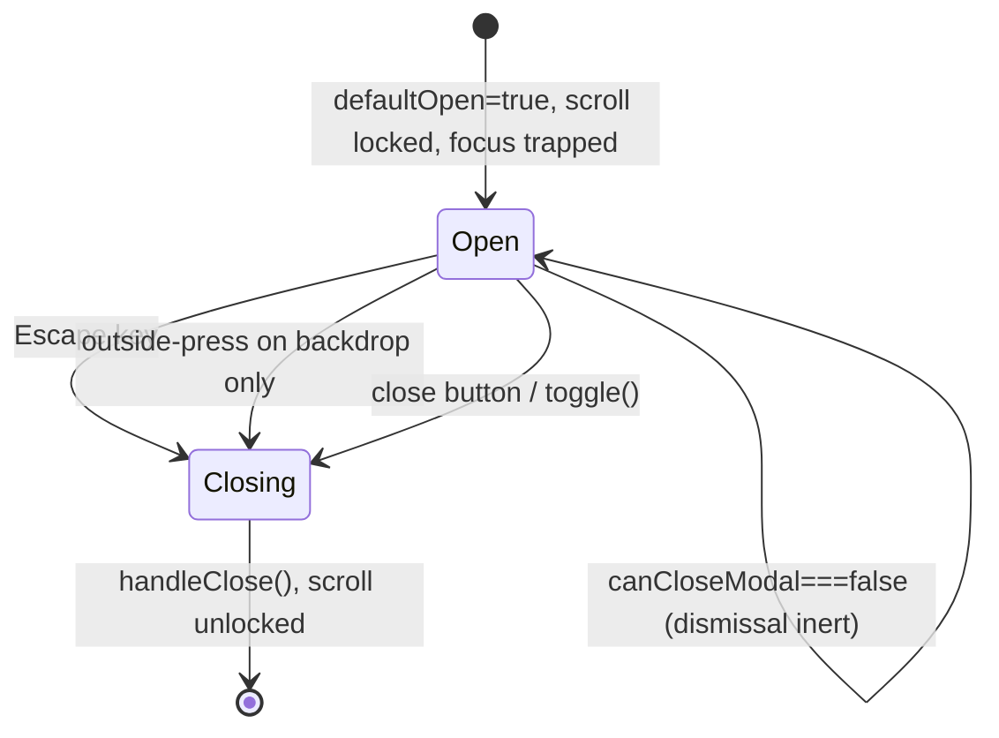

### 1.10 Selection controls — Tabs, SegmentedControl, Switch, RadioGroup, Select

The **User action** column is the literal gesture the user performs.

| Component                            | User action (gesture) | Notes                                                                                                                |
| ------------------------------------ | --------------------- | -------------------------------------------------------------------------------------------------------------------- |
| `Tabs.tsx`                           | Click / Arrow keys    | Tracks `focusedIndex` separately from `selectedIndex` (roving tabindex); arrow keys move focus, Enter/Space selects. |
| `SegmentedControl.tsx`               | Click                 | Single-select segmented toggle (e.g. billing period).                                                                |
| `Switch.tsx`                         | Click / Space         | Boolean toggle with `role='switch'`.                                                                                 |
| `RadioGroup.tsx` / `Field.RadioItem` | Click / Arrow keys    | Single-select; rendered as bordered option rows (`Form.tsx:241-274`).                                                |
| `Select.tsx`                         | Click / keyboard      | Popover-backed option list.                                                                                          |

### 1.11 Remaining interactive elements

The **User action** column is the literal gesture the user performs.

| Component                                    | User action (gesture)                   | Behavior / edge cases                                                                                |
| -------------------------------------------- | --------------------------------------- | ---------------------------------------------------------------------------------------------------- |
| `ClipboardInput.tsx` (+ `useClipboard`)      | Click "copy"                            | Copies value, shows transient "copied" feedback; falls back gracefully if clipboard API unavailable. |
| `Collapsible.tsx`                            | Click                                   | Animated height expand/collapse; honors reduced motion.                                              |
| `Tooltip.tsx`                                | Hover / focus                           | Floating-UI positioned; appears on focus too (keyboard accessible).                                  |
| `Pagination.tsx`                             | Click prev/next/page                    | Disables prev on first page / next on last.                                                          |
| `DataTable.tsx`                              | Click rows / paginate                   | Loading and empty states; row-level actions.                                                         |
| `TagInput.tsx`                               | Type + Enter/comma; Backspace to remove | Tokenizes input into tags (e.g. invite emails); Backspace on empty input removes the last tag.       |
| `PhoneInput/`                                | Type + country select                   | Formats as-you-type; country code dropdown.                                                          |
| `TimerButton.tsx`                            | Click after countdown                   | Disabled until a countdown elapses (resend gating).                                                  |
| `AvatarUploader.tsx`                         | Click / drag-drop / file pick           | Image selection + crop; loading state during upload.                                                 |
| `PreviewButton.tsx` / `ArrowBlockButton.tsx` | Click                                   | Row-style buttons used in method lists.                                                              |

---

## Part 2 — Cross-cutting interaction concerns

Patterns that recur across many flows, documented once and referenced from Part 3.

### 2.1 Loading / pending

Two loading sources compose: the **card** state (`useCardState`, Part 1.3) and the **form status** (`useLoadingStatus`). `Form.Root` ORs them into `isDisabled` so every submit/reset button and field locks while either is loading (`Form.tsx:48`). Non-form async actions use `card.runAsync` or `card.setLoading`/`setIdle` directly.

### 2.2 Error routing — `src/utils/errorHandler.ts`

`handleError(err, fieldStates, setGlobalError)` is the universal funnel for interaction errors:

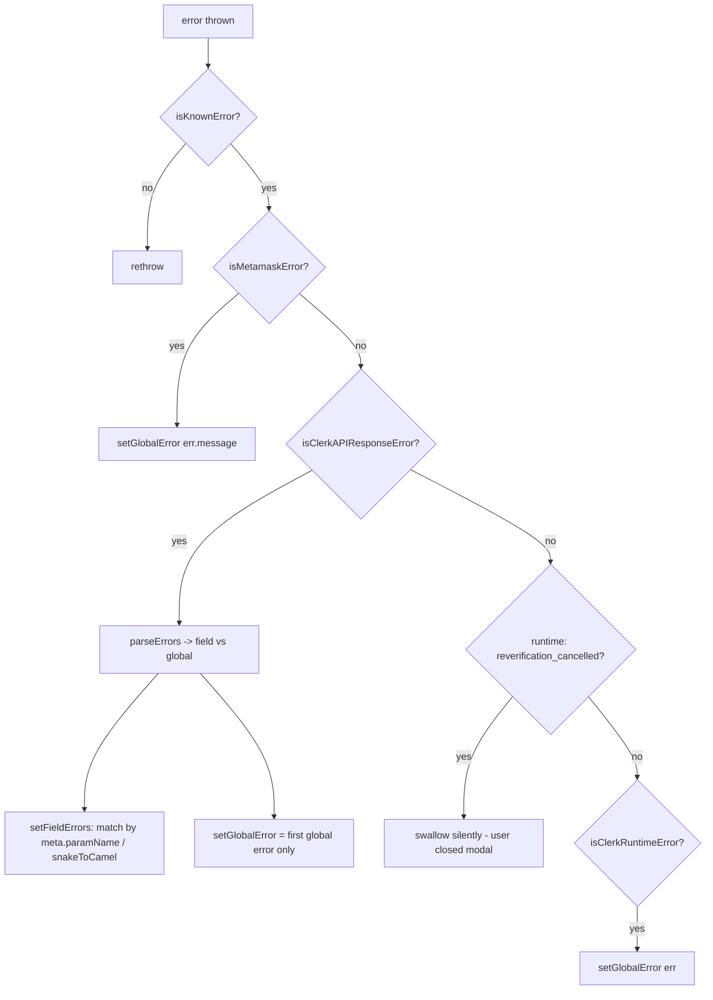

**Edge cases:**

1. **Field vs global split.** Errors with `meta.paramName` become field errors and are matched to a field by exact id or `snakeToCamel(paramName)`; the rest are global (`errorHandler.ts:39-54,122-139`).
2. **Only the first global error is shown** (no snackbar stacking yet) (`errorHandler.ts:132-137`).
3. **`reverification_cancelled` is swallowed** — closing the reverification modal is not an error (`errorHandler.ts:78-81`).
4. **Unknown errors rethrow** rather than being silently eaten (`errorHandler.ts:66-68`).
5. **Custom `buildErrorMessage`** per field — e.g. password forms turn an array of complexity errors into one localized sentence.

### 2.3 Success

Success is shown via `SuccessPage.tsx` or transient field feedback. Key edge case: **capture success copy in a `ref` before the mutation**, because the underlying resource updates after the call and would otherwise change the message. Example: password "set" vs "update" wording is snapshotted into a `ref` before `updatePassword()` (PasswordForm). OTP flows show success feedback for 750 ms before advancing (Part 1.6).

### 2.4 Reverification — `useReverification()`

Sensitive mutations are wrapped in `useReverification(...)` (from `@clerk/shared/react`), which transparently prompts for re-auth when required:

- EmailForm: `createEmailAddress = useReverification(email => user.createEmailAddress({ email }))` (`EmailForm.tsx:66`).
- EmailsSection: `setPrimary = useReverification(() => user.update({ primaryEmailAddressId }))` (`EmailsSection.tsx:130`).

**Edge case — cancel path.** If the user dismisses the reverification modal, the promise rejects with `reverification_cancelled`, which `handleError` swallows (Part 2.2). Some flows special-case it to also `close()` (e.g. AddAuthenticatorApp closes the screen instead of showing an error).

### 2.5 Disabled-from-business-logic

Beyond loading, interactions can be disabled by domain rules:

- **SSO-managed users** can't edit password locally — the password form disables inputs and renders a read-only `InformationBox`, showing only a reset button.
- **`shouldAllowCreation` / `shouldAllowDeletion`** props gate whether add/remove actions render at all (e.g. `EmailsSection.tsx:42-48`; the delete action is filtered out of the menu when deletion is disallowed, `EmailsSection.tsx:156-164`).
- **Empty-state early returns** — e.g. an MFA section with no methods left to add returns null/empty rather than an interactive form.

### 2.6 Motion & reduced motion

Animations are gated behind a two-factor `isMotionSafe` check:

```js
const prefersReducedMotion = usePrefersReducedMotion();
const { animations: layoutAnimations } = useAppearance().parsedOptions;
const isMotionSafe = !prefersReducedMotion && layoutAnimations !== false;
```

`usePrefersReducedMotion` reads `(prefers-reduced-motion: no-preference)` with a correct SSR fallback and live `change` listener (incl. a Safari iOS 13.4 `addListener` shim) (`usePrefersReducedMotion.ts`). When `!isMotionSafe`, transitions/keyframes are dropped to `none`.

The gate is used consistently across the motion-bearing elements: `Collapsible`, `Drawer`, `Tooltip`, `FormControl`, `NotificationCountBadge`, and (per-flow) `CheckoutComplete` / `PricingTableMatrix`.

**Worked example — `Collapsible` expand/collapse** (`Collapsible.tsx:27-89`):

- `isMotionSafe = !prefersReducedMotion && animations` (the appearance flag is read straight off `parsedOptions`).
- When motion-safe, height animates via a `grid-template-rows` transition plus an opacity/mask fade; when not, `transition: 'none'` so the content simply snaps open/closed.

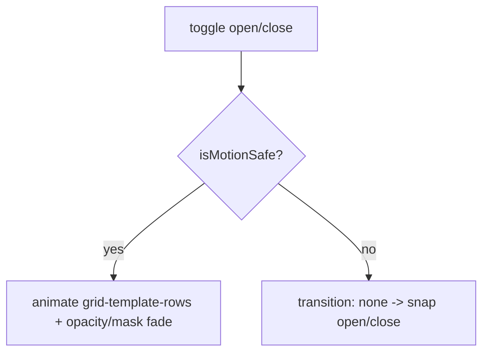

### 2.7 Keyboard, focus & direction

| Concern                        | Mechanism                                                                                               |
| ------------------------------ | ------------------------------------------------------------------------------------------------------- |
| Enter submits                  | Hidden first-child submit button (Part 1.1).                                                            |
| Escape / outside-press dismiss | Floating-UI `useDismiss` in Modal/Drawer/Popover/Menu (Parts 1.8–1.9).                                  |
| Arrow-key nav                  | Menus and selection controls (Parts 1.8, 1.10).                                                         |
| Focus trap + initial focus     | `FloatingFocusManager` / `initialFocusRef` in overlays.                                                 |
| Scroll lock                    | `useScrollLock` while a modal is open (Part 1.9).                                                       |
| RTL                            | `useDirection` / `useAppearance` direction propagation.                                                 |
| Auto-focus                     | Opt-in per field (`autoFocus={!disableAutoFocus}`) and OTP (`useAppearance().parsedOptions.autoFocus`). |

---

## Part 3 — Per-flow interaction inventory

One subsection per directory in `src/components/`. Each lists the flow's distinctive interactions; everything else is inherited from Parts 1–2. The UserProfile email flow is the worked exemplar (3.7) — read it first.

### Authentication

#### 3.1 SignIn — `src/components/SignIn/`

Multi-factor auth flow assembled from `Wizard`-like routing + the primitives above.

- **Start** (`SignInStart.tsx`): identifier entry + `SocialButtons` (1.7) + enterprise/SSO buttons; combined-flow transfer to SignUp (`handleCombinedFlowTransfer.ts`).
- **Factor One** (`SignInFactorOne*`): strategy switch across Password, Email Code (1.6), Email Link, Phone Code (1.6), Passkey, Enterprise SSO, Solana wallet. `AlternativeMethods.tsx` / `HavingTrouble.tsx` are the "can't use this method" escape hatches.
- **Factor Two** (`SignInFactorTwo*`): TOTP, Email/Phone code, Backup code.
- **Reset password** (`ResetPassword.tsx` → `ResetPasswordSuccess.tsx`).
- Edge cases: per-strategy loading metadata; "last used" strategy badge; combined sign-in/up transfer preserves entered identifier.

#### 3.2 SignUp — `src/components/SignUp/`

- Start form (`SignUpStart.tsx` / `SignUpForm.tsx`) with field set driven by instance config; `LegalConsentCheckbox` gating.
- Verification: `SignUpVerifyEmail` / `SignUpVerifyPhone` (OTP, 1.6), `SignUpEmailLinkCard` (poll/await link).
- Social/enterprise (`SignUpSocialButtons`, `SignUpEnterpriseConnections`), `SignUpSSOCallback` (redirect-return; reads `__internal_last_error`, 1.3).
- `SignUpContinue` (resume a partial sign-up), `SignUpRestrictedAccess` (no-interaction terminal state).

#### 3.3 UserVerification — `src/components/UserVerification/`

Reverification challenge UI (the modal `useReverification` drives). Factor-one/two method selection mirrors SignIn; `useReverificationAlternativeStrategies` for fallbacks. Edge case: cancel → `reverification_cancelled` (2.4).

#### 3.4 GoogleOneTap — `src/components/GoogleOneTap/`

Google One Tap prompt; mostly programmatic, surfaces errors via card state.

#### 3.5 Waitlist — `src/components/Waitlist/`

Single email-entry form; success/error via the standard lifecycle.

### User management

#### 3.6 UserProfile (overview) — `src/components/UserProfile/`

Dashboard of sections, each an `Action.Root` (1.4) containing a list + inline add/edit/remove forms. Pages: Account, Security, Billing (`UserProfileRoutes.tsx`, `*Page.tsx`); navigation via `UserProfileNavbar.tsx`. Sections: Profile, Email, Phone, Password, MFA, Passkey, Web3, ConnectedAccounts, EnterpriseAccounts, ActiveDevices, DeleteUser.

#### 3.7 UserProfile — Email (WORKED EXEMPLAR) — `EmailForm.tsx`, `EmailsSection.tsx`

The richest single interaction in the package and the focus of the current branch.

**User journeys** — the exact steps a person takes for each task (▸ required, ○ optional):

_Add an email address_

- **▸** Click **"Add email address"** at the bottom of the section. ↳ system: an `Action.Card` expands inline and scrolls into view.
- **▸** Type the email into the field. ↳ system: the **Add** button stays disabled until the value is >1 char and isn't your username.
- **▸** Submit (click **Add** or press **Enter**). ↳ system: the address is created (a reverification prompt may appear — see below), then the card advances to the **verify** step.
- **▸** Complete verification — usually **type the 6-digit code** (auto-submits, 1.6); or click the **email link** sent to the address; or finish the **enterprise SSO** redirect. ↳ system: on success the card collapses and the new address appears with an **Unverified** badge removed.
- **○** Click **Cancel** at any point to collapse without saving.

_Make an email primary_

- **▸** Click the **⋯** menu on a verified, non-primary address → **"Set as primary"**. ↳ system: runs reverification-guarded; the **Primary** badge moves to it. A failure shows a card error.

_Verify an existing unverified email_

- **▸** Click the **⋯** menu → **"Verify"** (offered for unverified addresses, primary or not). ↳ system: the card opens **directly on the verify step** (Wizard `defaultStep=1`).
- **▸** Enter the code / click the link / finish SSO, as above.

_Remove an email_

- **▸** Click the **⋯** menu → **"Remove email"** (only if deletion is allowed). ↳ system: a **destructive** `Action.Card` expands.
- **▸** Confirm removal. ↳ system: reverification-guarded delete; the row disappears.

_If reverification is required_ (any of the above touching a sensitive mutation)

- **▸** Complete the re-auth challenge in the prompt that appears.
- **○** Or dismiss it — ↳ system: the action is silently abandoned (no error shown; `reverification_cancelled`, 2.4).

**EmailsSection** (`EmailsSection.tsx`) — list + actions:

- Emails sorted by verification (`sortIdentificationBasedOnVerification`), each with **Primary** / **Unverified** badges (`EmailsSection.tsx:59-77`).
- **Per-email `ThreeDotsMenu` (1.8)** whose actions are a small state machine (`EmailsSection.tsx:134-164`):

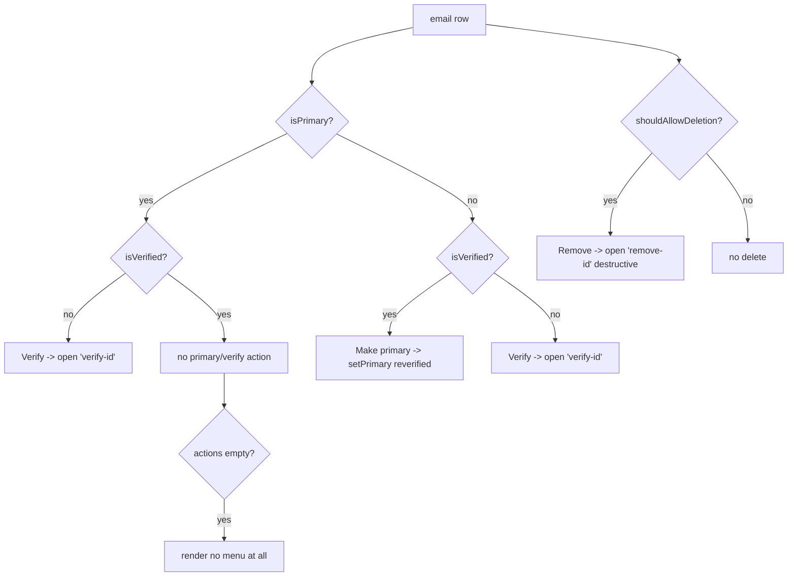

- **Make primary** is reverification-wrapped; failures route to the card error (`EmailsSection.tsx:130-148`).
- **Add** uses an `Action.Trigger` → `Action.Open value='add'` wrapping the form in an `Action.Card` (`<Action.Card><EmailScreen /></Action.Card>`), exactly like remove/verify — all three actions share the same `Action.Card` expand pattern (`EmailsSection.tsx:84-109`).

**EmailForm** (`EmailForm.tsx`) — the add/verify wizard:

- Two-step `Wizard` (1.5): entry (step 0) → verify (step 1); opens on step 1 when editing an existing address (`EmailForm.tsx:70-73`).
- **Submit gate:** `canSubmit = emailField.value.length > 1 && user?.username !== emailField.value` (`EmailForm.tsx:82`).
- **Strategy-based verification rendering** (`EmailForm.tsx:232-241`):

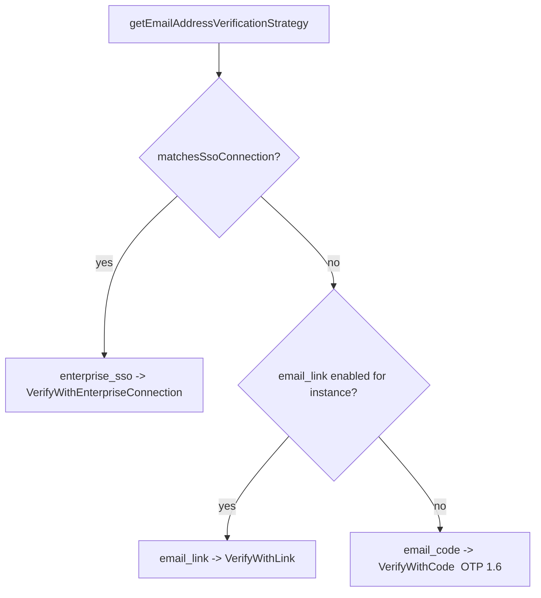

- **Entry step layout:** the form renders inside a `FormContainer` (header title/subtitle) with `Form.Root` → `Form.ControlRow` → `Form.PlainInput` and a `FormButtons` row (submit gated on `canSubmit`, reset → `onReset`). The verify step is a second `FormContainer` selected by strategy.
- **Resource ref** avoids refetch and carries the created address into the verify step (`emailAddressRef`, `EmailForm.tsx:68,91`).
- Errors → `handleError(e, [emailField], card.setError)` (field + global split, 2.2).

#### 3.8 UserProfile — other sections

- **PasswordForm**: conditional current-password field (`user.passwordEnabled && !reverification`); `useConfirmPassword` match validation with `onBlur` revalidation; password-strength via `validatePassword`; success copy snapshotted in a ref (2.3); SSO users get a read-only disabled form (2.5).
- **PhoneForm / PhonesSection**: same add→verify wizard as email, with phone OTP and `PhoneInput` formatting.
- **MfaSection / MfaForm / AddAuthenticatorApp**: strategy selection; `AddAuthenticatorApp` creates a TOTP in a mount effect and **closes silently on `reverification_cancelled`**; empty-state returns when no methods remain.
- **DeleteUserForm**: destructive — submit gated on the confirmation input exactly matching the localized confirmation phrase; on success `setActive({ session: null, redirectUrl })` where the redirect depends on whether other sessions remain.
- **RemoveResourceForm**: generic destructive confirm wrapped in `useReverification`; `onSuccess`/`onReset` both call the Action `close()`.
- **PasskeySection, Web3Form, ConnectedAccountsSection, EnterpriseAccountsSection, ActiveDevicesSection, ProfileForm, UserProfileAvatarUploader**: list + inline add/remove using `Action` (1.4) and the standard lifecycle; avatar uploader adds file pick / drag-drop / crop.

#### 3.9 UserButton — `src/components/UserButton/`

- `UserButtonTrigger` (popover toggle) → `UserButtonPopover` with session actions.
- `useMultisessionActions`: switch session, sign out of one/all, add account; each is an async action with its own loading.

#### 3.10 UserAvatar — `src/components/UserAvatar/`

Display-only with shimmer loading (`withAvatarShimmer`).

### Organization

#### 3.11 OrganizationProfile — `src/components/OrganizationProfile/`

- General page: name/slug/logo editing; `VerifiedDomainForm` / `AddDomainForm`.
- Members: `ActiveMembersList`, `InvitedMembersList`, `RequestToJoinList`, `MembersSearch` (debounced via `useSearchInput`/`useDebounce`), `MembersActions` (role change / remove, reverification-guarded), `InviteMembersForm` (TagInput emails, 1.11).
- Billing pages and SSO config (delegates to ConfigureSSO, 3.19).

#### 3.12 OrganizationSwitcher — `src/components/OrganizationSwitcher/`

Trigger → popover with `UserMembershipList`, `UserInvitationSuggestionList` (accept/decline actions), and create-org / manage actions.

#### 3.13 OrganizationList — `src/components/OrganizationList/`

`UserMembershipList` / `UserInvitationList` / `UserSuggestionList` with accept/decline/select; paginated lists.

#### 3.14 CreateOrganization — `src/components/CreateOrganization/`

Create form (name/slug/logo) → optional invite step; `createSlug` auto-derivation from name.

### Billing

#### 3.15 Checkout — `src/components/Checkout/`

`CheckoutPage` → `CheckoutForm` (payment entry) → `CheckoutComplete`. Submit/loading via the standard lifecycle; `canCloseModal=false` semantics during processing (1.9).

#### 3.16 PaymentMethods — `src/components/PaymentMethods/`

`AddPaymentMethod`, `PaymentMethodRow` actions (set default / remove), revocation confirmations.

#### 3.17 Subscriptions / Plans / PricingTable / SubscriptionDetails / Statements / PaymentAttempts

List + detail interactions: subscribe/upgrade/cancel actions, `SegmentedControl` for billing period (1.10), `LineItems` display, paginated tables, drawer-based detail views (lazy `Mounted*Drawer`).

### Admin / integration

#### 3.18 APIKeys — `src/components/APIKeys/`

`ApiKeysTable` + `CreateAPIKeyForm`; modal interactions: `APIKeyModal`, `CopyAPIKeyModal` (clipboard, 1.11), `RevokeAPIKeyConfirmationModal` (destructive confirm). One-time secret reveal/copy is the key edge case.

#### 3.19 ConfigureSSO — `src/components/ConfigureSSO/`

A multi-step wizard (`SelectProviderStep` → `VerifyDomainStep` → `TestConfigurationStep` → `ConfirmationStep`) with its own navbar/header and per-step validation gating; back/next navigation.

#### 3.20 OAuthConsent — `src/components/OAuthConsent/`

Allow/Deny consent screen; `OrgSelect` (choose org context), scope `ListGroup`. Terminal allow/deny actions with loading.

#### 3.21 SessionTasks — `src/components/SessionTasks/`

Post-auth task gating (choose org, reset password, setup MFA, enable orgs) — see the `tasks*` flow/part metadata in `contexts/index.tsx:104-108`.

#### 3.22 ImpersonationFab — `src/components/ImpersonationFab/`

Draggable floating action button to exit impersonation; drag + click interactions.

#### 3.23 BlankCaptchaModal & GoogleOneTap & devPrompts & prefetch-organization-list

- `BlankCaptchaModal`: hosts a CAPTCHA challenge in a modal (1.9).
- `devPrompts` / `DevModeNotice`: development-only informational prompts.
- `prefetch-organization-list.tsx`: data prefetch, no direct UI interaction.

---

## Part 4 — Edge-case checklist

A flat, scannable list for review/regression. Each links back to where it's documented.

- [ ] **Enter submits via hidden first-child button** (not `type=submit` on visible buttons; `display:none` avoided for Safari) — 1.1
- [ ] **Double-submit prevented** by disabling buttons while `card.isLoading || status.isLoading`, reset in `finally` — 1.1
- [ ] **`reverification_cancelled` is swallowed** (closing the modal isn't an error); some flows also `close()` the screen — 2.2, 2.4
- [ ] **Unknown errors rethrow** rather than being eaten — 2.2
- [ ] **Field vs global error split** by `meta.paramName` (with `snakeToCamel` matching); only first global shown — 2.2
- [ ] **Custom `buildErrorMessage`** per field (e.g. password complexity) — 1.2, 2.2
- [ ] **OTP auto-submits** when all N slots fill; **inputs lock** during verify; **750 ms settle** on success and on error before reset — 1.6
- [ ] **Resend is timer-gated** and hidden/disabled on success — 1.6
- [ ] **Per-action loading metadata** spins only the clicked button (OAuth) — 1.3, 1.7
- [ ] **`idleAfterDelay`** avoids an idle flash before OAuth redirect — 1.7
- [ ] **Error seeded from `window.Clerk.__internal_last_error`** on mount/route change (survives redirects) — 1.3
- [ ] **Modal outside-press dismiss is backdrop-only**; content clicks don't close — 1.9
- [ ] **`canCloseModal === false`** makes Escape/outside-press/close inert — 1.9
- [ ] **Scroll lock** engaged while a modal is open, released on unmount — 1.9
- [ ] **Focus trap + `initialFocusRef`** in overlays; menus support Arrow-key roving focus over BUTTON children only — 1.8, 1.9
- [ ] **`closeAfterClick=false`** keeps a menu open after an item click — 1.8
- [ ] **Action single-open invariant** (opening one section closes others); **auto-scroll into view** on open — 1.4
- [ ] **Trigger chains the child's own `onClick`** before opening (Action + Menu) — 1.4, 1.8
- [ ] **Wizard `defaultStep`** opens mid-flow (edit existing → verify step); `onNextStep` clears card error — 1.5
- [ ] **Submit gates**: email length>1 & ≠ username; password match & strength; delete-user exact-phrase match — 3.7, 3.8
- [ ] **Strategy-based verification** (`enterprise_sso` / `email_link` / `email_code`) — 3.7
- [ ] **Reverification-wrapped mutations** (create email, set primary, delete, role change) — 2.4
- [ ] **Resource `ref`** carries a created/edited resource across steps without refetch — 3.7
- [ ] **Success copy snapshotted in a `ref`** before mutation (set vs update) — 2.3
- [ ] **Reduced-motion + `appearance.animations` gate** (`isMotionSafe`) drops transitions/keyframes to `none` (e.g. `Collapsible` snaps instead of animating height) — 2.6
- [ ] **Business-logic disabled states**: SSO users can't edit password; `shouldAllowCreation/Deletion` gate actions; empty-state early returns — 2.5
- [ ] **Destructive confirmations** (remove resource, revoke API key, delete user) with `variant='destructive'` styling — 1.8, 3.8, 3.18
- [ ] **One-time secret reveal/copy** for API keys — 3.18
- [ ] **Debounced search** in member lists — 3.11
- [ ] **TagInput** Backspace-removes-last-tag for invite emails — 1.11, 3.11
- [ ] **RTL / direction** propagation — 2.7

---

## Maintenance

- When adding a new interactive `element`, document it in Part 1 (or 1.11) and add any new edge case to Part 4.
- When adding a `components/<Flow>`, add a Part 3 subsection — keep the "one subsection per directory" invariant (the coverage check below depends on it).
- **Coverage check:** `ls packages/ui/src/components` should map 1:1 onto Part 3 subsections.
